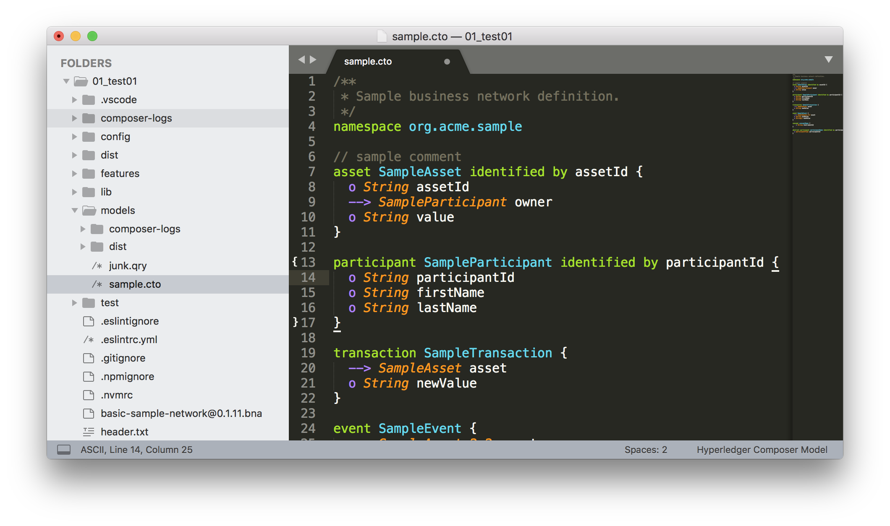
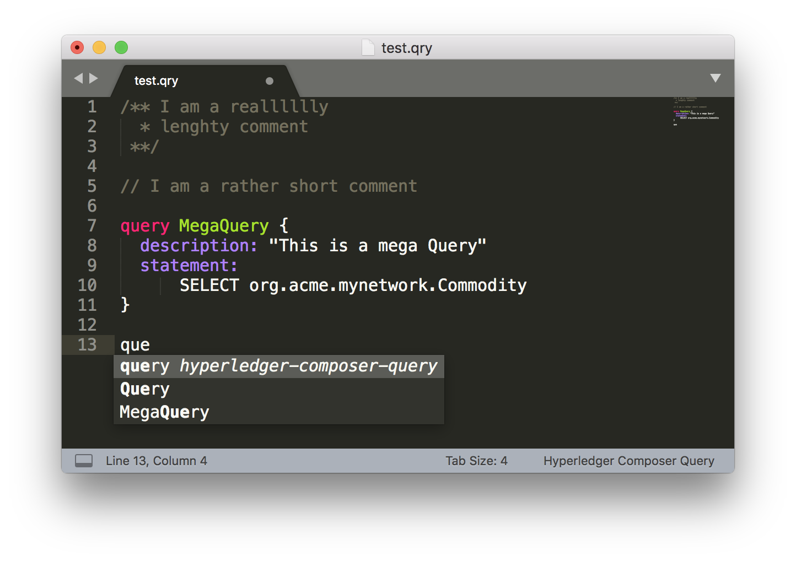
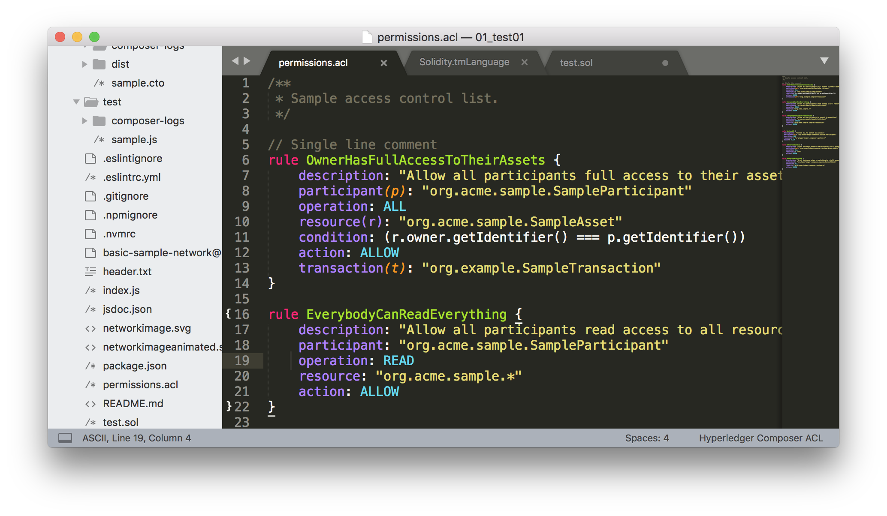

= Hyperledger Composer Sublime Package

A set of SublimeText:

* syntax
* language definition
* snippets
* build

To make from SublimeText a cosy Hyperledger Composer home.

Use +Control Package+ to install.

== Models

Source: https://hyperledger.github.io/composer/reference/cto_language.html

== Queries

== ACL

source: https://hyperledger.github.io/composer/reference/acl_language.html

== Transactions Processor Functions

NOTE: Those are not Implemented yet

source: https://hyperledger.github.io/composer/reference/js_scripts.html
