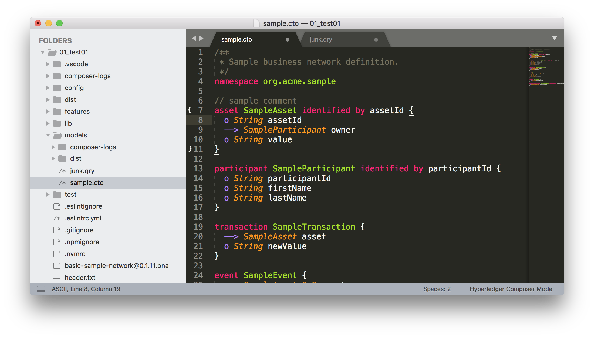

= Hyperledger Composer Sublime Package

A set of SublimeText:

* syntax
* language definition
* snippets
* build

To make from SublimeText a cosy Hyperledger Composer home.

Use +Control Package+ to install.

== Models

== Queries

